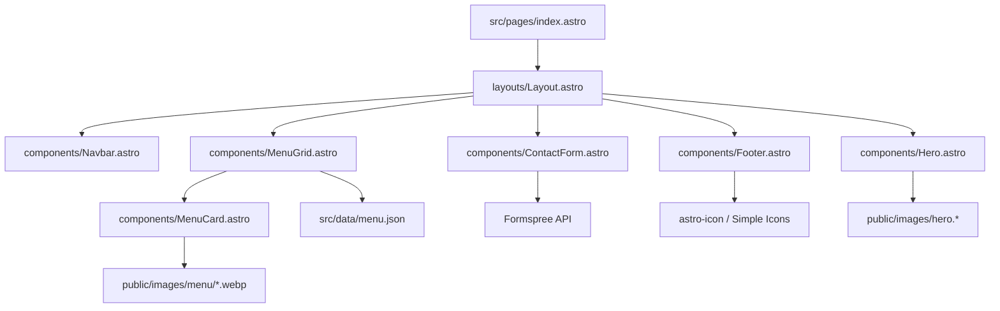
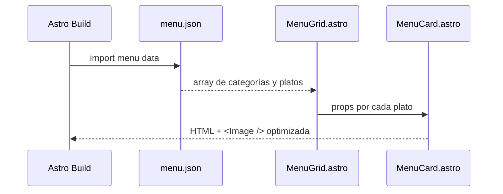
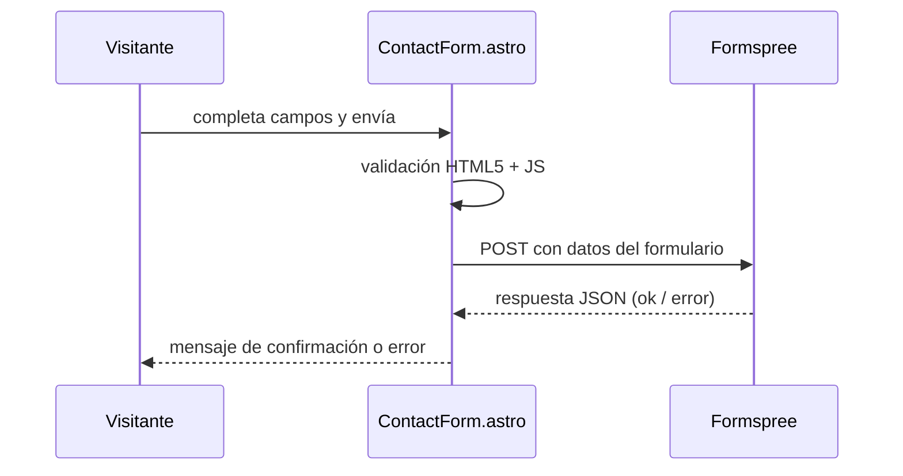

# Documento de Diseño Técnico
# Sabores Huallada de Perú — Sitio Web

## Visión General

El sitio web de **Sabores Huallada de Perú** es una aplicación web estática de una sola página (single-page) construida con **Astro 6** y **Tailwind CSS**. Su propósito es servir como presencia digital del restaurante: mostrar el menú con fotos, los horarios, la ubicación y un formulario de contacto.

Al ser un sitio estático generado en tiempo de compilación, no requiere servidor propio ni base de datos. El formulario de contacto se delega a **Formspree**, y el mapa se embebe mediante un `<iframe>` de Google Maps.

### Objetivos de diseño

- Carga rápida (< 3 segundos en banda ancha) gracias a la generación estática de Astro y optimización de imágenes.
- Diseño responsivo desde 320 px (móvil) hasta escritorio.
- SEO básico con metaetiquetas, `lang="es"` y atributos `alt` en imágenes.
- Mantenimiento sencillo: los datos del menú se gestionan en un único archivo JSON.

---

## Arquitectura

El sitio sigue la arquitectura de **Astro Islands**: todo el contenido se renderiza en el servidor (SSG) y solo los componentes interactivos (menú hamburguesa, formulario) usan JavaScript mínimo en el cliente.



### Flujo de datos del menú



### Flujo del formulario de contacto



---

## Componentes e Interfaces

### `layouts/Layout.astro`

Layout base que envuelve todas las páginas. Recibe props de SEO y aplica fuentes, estilos globales y View Transitions de Astro.

```typescript
interface Props {
  title: string;        // Título de la página para <title> y og:title
  description: string;  // Descripción para meta description y og:description
}
```

### `components/Navbar.astro`

Barra de navegación fija con enlaces a las secciones de la página. En móvil muestra un botón hamburguesa que despliega el menú. La lógica de toggle se implementa con un `<script>` inline mínimo.

- Links: `#menu`, `#horarios`, `#ubicacion`, `#contacto`
- Estado del menú hamburguesa: gestionado con `data-open` en el elemento raíz del nav y CSS.

### `components/Hero.astro`

Sección principal de bienvenida. Muestra el nombre del restaurante, una descripción breve y una imagen de fondo optimizada.

```typescript
interface Props {
  title: string;
  subtitle: string;
  imageSrc: string;
  imageAlt: string;
}
```

### `components/MenuGrid.astro`

Importa `src/data/menu.json`, agrupa los platos por categoría y renderiza un `<MenuCard>` por cada plato.

### `components/MenuCard.astro`

Tarjeta individual de plato. Usa el componente `<Image />` de Astro para optimización automática (WebP, lazy loading, dimensiones).

```typescript
interface Props {
  name: string;
  description: string;
  category: string;
  imageSrc: string;    // ruta relativa a public/images/menu/
  imageAlt: string;
  price?: string;      // opcional
}
```

### `components/ContactForm.astro`

Formulario con campos: nombre, correo electrónico, asunto y mensaje. Envía datos a Formspree mediante `fetch`. Muestra mensajes de error de validación y confirmación de envío.

```typescript
// Configuración
const FORMSPREE_ENDPOINT = "https://formspree.io/f/{form_id}";
```

### `components/Footer.astro`

Pie de página con iconos de redes sociales (usando `astro-icon` + Simple Icons), información de contacto y copyright.

---

## Modelos de Datos

### `src/data/menu.json`

Estructura del archivo de datos del menú:

```typescript
interface MenuItem {
  id: string;           // slug único, ej: "ceviche-clasico"
  name: string;         // nombre del plato
  description: string;  // descripción breve
  category: string;     // "entradas" | "principales" | "bebidas" | "postres"
  imageSrc: string;     // "/images/menu/ceviche-clasico.webp"
  imageAlt: string;     // texto alternativo descriptivo
  price?: string;       // precio opcional, ej: "S/ 25"
}

interface MenuData {
  categories: string[];   // orden de categorías para renderizado
  items: MenuItem[];
}
```

Ejemplo de contenido:

```json
{
  "categories": ["entradas", "principales", "bebidas", "postres"],
  "items": [
    {
      "id": "ceviche-clasico",
      "name": "Ceviche Clásico",
      "description": "Pescado fresco marinado en limón con ají amarillo y choclo.",
      "category": "entradas",
      "imageSrc": "/images/menu/ceviche-clasico.webp",
      "imageAlt": "Plato de ceviche clásico peruano con choclo y camote",
      "price": "S/ 25"
    }
  ]
}
```

### Estructura de archivos del proyecto

```
sabores-huallada-website/
├── public/
│   ├── favicon.svg
│   └── images/
│       ├── hero.webp
│       └── menu/
│           ├── ceviche-clasico.webp
│           └── ...
├── src/
│   ├── components/
│   │   ├── Navbar.astro
│   │   ├── Hero.astro
│   │   ├── MenuCard.astro
│   │   ├── MenuGrid.astro
│   │   ├── ContactForm.astro
│   │   └── Footer.astro
│   ├── data/
│   │   └── menu.json
│   ├── layouts/
│   │   └── Layout.astro
│   └── pages/
│       └── index.astro
├── astro.config.mjs
├── tailwind.config.mjs
└── package.json
```

### Paleta de colores y tipografía

```typescript
// tailwind.config.mjs — colores personalizados
const colors = {
  "peru-red":    "#C0392B",   // rojo peruano
  "jungle-green":"#1A6B3C",   // verde selva amazónica
  "gold":        "#D4A017",   // dorado
  "cream":       "#FDF6EC",   // blanco cálido (fondo)
  "dark":        "#1C1C1C",   // texto principal
};

// Fuentes (Google Fonts via @fontsource o CDN)
// Títulos: Playfair Display (serif)
// Cuerpo:  Inter o Poppins (sans-serif)
```

---


## Propiedades de Corrección

*Una propiedad es una característica o comportamiento que debe mantenerse verdadero en todas las ejecuciones válidas de un sistema — esencialmente, una declaración formal sobre lo que el sistema debe hacer. Las propiedades sirven como puente entre las especificaciones legibles por humanos y las garantías de corrección verificables automáticamente.*

---

### Propiedad 1: Cada plato del menú tiene imagen, nombre y descripción renderizados

*Para cualquier* conjunto de platos definidos en `menu.json`, el componente `MenuCard` renderizado para cada plato debe contener exactamente un elemento `` (o `<Image />`), el nombre del plato y su descripción como texto visible.

**Valida: Requisitos 2.2, 2.3**

---

### Propiedad 2: Los platos se agrupan correctamente por categoría

*Para cualquier* conjunto de platos con categorías asignadas en `menu.json`, el HTML renderizado por `MenuGrid` debe agrupar cada plato bajo el encabezado de su categoría correspondiente, y ningún plato debe aparecer bajo una categoría incorrecta.

**Valida: Requisito 2.5**

---

### Propiedad 3: Todas las imágenes tienen atributo `alt` no vacío

*Para cualquier* imagen renderizada en el sitio (menú, hero, etc.), el atributo `alt` debe estar presente y contener una cadena no vacía y no compuesta únicamente de espacios en blanco.

**Valida: Requisito 8.3, Requisito 2.4 (edge case)**

---

### Propiedad 4: Todos los enlaces de redes sociales tienen icono y abren en nueva pestaña

*Para cualquier* enlace de red social renderizado en el footer, el elemento debe contener un icono SVG (o equivalente) y tener el atributo `target="_blank"` con `rel="noopener noreferrer"`.

**Valida: Requisitos 5.2, 5.3**

---

### Propiedad 5: El formulario rechaza cualquier entrada inválida con mensaje de error

*Para cualquier* combinación de campos del formulario de contacto donde al menos un campo requerido esté vacío (o contenga solo espacios en blanco), o donde el campo de correo electrónico no tenga formato válido, el formulario no debe enviarse y debe mostrar al menos un mensaje de error visible.

**Valida: Requisitos 6.3, 6.4**

---

### Propiedad 6: El formulario envía los datos correctos a Formspree cuando es válido

*Para cualquier* combinación válida de nombre, correo electrónico, asunto y mensaje (todos no vacíos, correo con formato válido), el formulario debe realizar un `POST` al endpoint de Formspree con todos los campos incluidos en el cuerpo de la solicitud.

**Valida: Requisito 6.2**

---

## Manejo de Errores

### Imágenes no disponibles

- El componente `<Image />` de Astro genera imágenes optimizadas en tiempo de compilación; si una imagen no existe en `public/images/menu/`, el build fallará con un error claro.
- En producción, si una imagen no carga (error de red), el navegador mostrará el texto del atributo `alt` gracias a que todas las imágenes lo tienen definido (Propiedad 3).
- Se recomienda definir una imagen placeholder en `public/images/menu/placeholder.webp` y referenciarla como fallback en `MenuCard.astro`.

### Errores del formulario de contacto

| Escenario | Comportamiento esperado |
|---|---|
| Campo requerido vacío | Mensaje de error inline bajo el campo |
| Formato de email inválido | Mensaje de error inline bajo el campo de email |
| Error de red al enviar | Mensaje de error general: "No se pudo enviar el mensaje. Intenta de nuevo." |
| Respuesta de error de Formspree | Mismo mensaje de error general |
| Envío exitoso | Mensaje de confirmación: "¡Mensaje enviado! Te contactaremos pronto." |

### Errores de compilación

- Si `menu.json` tiene un formato inválido, Astro fallará en tiempo de compilación con un error de parseo JSON.
- Si falta una imagen referenciada en `menu.json`, el build fallará indicando el archivo faltante.

---

## Estrategia de Pruebas

### Enfoque dual: pruebas unitarias + pruebas basadas en propiedades

Las pruebas unitarias verifican ejemplos concretos y casos de borde. Las pruebas basadas en propiedades verifican que las propiedades universales se cumplen para cualquier entrada generada aleatoriamente. Ambas son complementarias y necesarias.

### Herramientas

| Tipo | Herramienta |
|---|---|
| Framework de pruebas | **Vitest** (integración nativa con Astro/Vite) |
| Pruebas de componentes | **@astrojs/test-utils** + **@testing-library/dom** |
| Pruebas basadas en propiedades | **fast-check** (biblioteca PBT para JavaScript/TypeScript) |
| Pruebas de accesibilidad | **axe-core** (via `@axe-core/playwright` o integración con Vitest) |

### Pruebas unitarias (ejemplos concretos)

Estas pruebas verifican comportamientos específicos y casos de borde:

- **Req 1.1**: El HTML renderizado contiene "Sabores Huallada de Perú".
- **Req 1.4**: El nav contiene los cuatro enlaces: `#menu`, `#horarios`, `#ubicacion`, `#contacto`.
- **Req 3.1–3.3**: La sección de horarios contiene "Lunes", "Viernes", "7:00 AM", "12:00 PM", "1:30 PM", "10:00 PM".
- **Req 4.1**: La sección de ubicación contiene "Centro de Pucallpa, Perú".
- **Req 4.3**: El iframe o enlace del mapa tiene `target="_blank"`.
- **Req 5.1**: Los enlaces de redes sociales contienen "@erasmofc".
- **Req 5.4**: Los iconos de redes sociales están dentro del elemento `<footer>`.
- **Req 6.1**: El formulario contiene inputs para nombre, email, asunto y textarea para mensaje.
- **Req 6.5**: Tras un envío exitoso (mock de Formspree), aparece el mensaje de confirmación.
- **Req 7.4**: El botón hamburguesa existe en el HTML.
- **Req 8.1**: El `<head>` contiene `<title>` y `<meta name="description">` no vacíos.
- **Req 8.2**: El elemento `<html>` tiene `lang="es"`.

### Pruebas basadas en propiedades (fast-check)

Cada prueba de propiedad debe ejecutarse con un mínimo de **100 iteraciones**. Cada prueba debe incluir un comentario de trazabilidad con el formato:

`// Feature: sabores-huallada-website, Propiedad {N}: {texto de la propiedad}`

#### Propiedad 1: Cada plato tiene imagen, nombre y descripción

```typescript
// Feature: sabores-huallada-website, Propiedad 1: Cada plato del menú tiene imagen, nombre y descripción renderizados
fc.assert(
  fc.property(
    fc.array(arbitraryMenuItem(), { minLength: 1 }),
    (items) => {
      const html = renderMenuGrid(items);
      return items.every(item =>
        html.includes(item.name) &&
        html.includes(item.description) &&
        html.includes(item.imageSrc)
      );
    }
  ),
  { numRuns: 100 }
);
```

#### Propiedad 2: Platos agrupados por categoría

```typescript
// Feature: sabores-huallada-website, Propiedad 2: Los platos se agrupan correctamente por categoría
fc.assert(
  fc.property(
    fc.array(arbitraryMenuItem(), { minLength: 1 }),
    (items) => {
      const html = renderMenuGrid(items);
      return items.every(item => {
        const categoryIndex = html.indexOf(item.category);
        const itemIndex = html.indexOf(item.name);
        return categoryIndex < itemIndex; // el encabezado de categoría aparece antes que el plato
      });
    }
  ),
  { numRuns: 100 }
);
```

#### Propiedad 3: Todas las imágenes tienen `alt` no vacío

```typescript
// Feature: sabores-huallada-website, Propiedad 3: Todas las imágenes tienen atributo alt no vacío
fc.assert(
  fc.property(
    fc.array(arbitraryMenuItem(), { minLength: 1 }),
    (items) => {
      const html = renderMenuGrid(items);
      const imgMatches = [...html.matchAll(/]+>/g)];
      return imgMatches.every(([tag]) => {
        const altMatch = tag.match(/alt="([^"]*)"/);
        return altMatch && altMatch[1].trim().length > 0;
      });
    }
  ),
  { numRuns: 100 }
);
```

#### Propiedad 4: Enlaces de redes sociales con icono y `target="_blank"`

```typescript
// Feature: sabores-huallada-website, Propiedad 4: Todos los enlaces de redes sociales tienen icono y abren en nueva pestaña
fc.assert(
  fc.property(
    fc.array(arbitrarySocialLink(), { minLength: 1 }),
    (links) => {
      const html = renderFooter(links);
      return links.every(link => {
        const linkHtml = extractLinkHtml(html, link.url);
        return linkHtml.includes('target="_blank"') &&
               linkHtml.includes('rel="noopener noreferrer"') &&
               (linkHtml.includes('<svg') || linkHtml.includes(' {
      const result = validateContactForm(input);
      return result.isValid === false && result.errors.length > 0;
    }
  ),
  { numRuns: 100 }
);
```

#### Propiedad 6: Formulario envía datos correctos cuando es válido

```typescript
// Feature: sabores-huallada-website, Propiedad 6: El formulario envía los datos correctos a Formspree cuando es válido
fc.assert(
  fc.property(
    arbitraryValidFormInput(), // genera combinaciones válidas de nombre, email, asunto, mensaje
    async (input) => {
      const postedData = await submitContactForm(input, mockFormspree);
      return postedData.name === input.name &&
             postedData.email === input.email &&
             postedData.subject === input.subject &&
             postedData.message === input.message;
    }
  ),
  { numRuns: 100 }
);
```

### Notas de implementación de pruebas

- Los componentes Astro se prueban extrayendo la lógica de renderizado a funciones TypeScript puras cuando sea posible (ej: `renderMenuGrid`, `validateContactForm`), facilitando las pruebas sin necesidad de un navegador completo.
- Para pruebas de integración que requieran el DOM completo, usar `@astrojs/test-utils` con Vitest.
- Las pruebas de propiedad deben definir generadores (`arbitrary*`) que produzcan datos realistas pero aleatorios.
